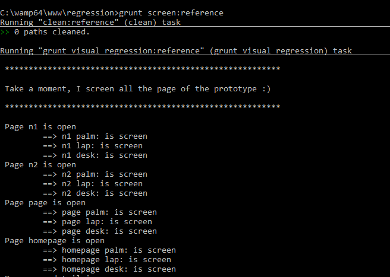
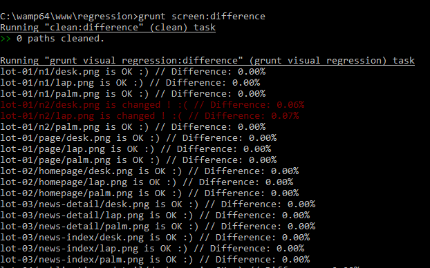
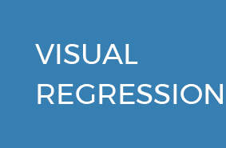

# grunt-visual-regression

> visual regression test

## Getting Started
This plugin requires Grunt `~0.4.5`

If you haven't used [Grunt](http://gruntjs.com/) before, be sure to check out the [Getting Started](http://gruntjs.com/getting-started) guide, as it explains how to create a [Gruntfile](http://gruntjs.com/sample-gruntfile) as well as install and use Grunt plugins. Once you're familiar with that process, you may install this plugin with this command:

```shell
npm install grunt-visual-regression --save-dev
```

Once the plugin has been installed, it may be enabled inside your Gruntfile with this line of JavaScript:

```js
grunt.loadNpmTasks('grunt-visual-regression');
```

## The "visual_regression" task

### Overview
In your project's Gruntfile, add a section named `visual_regression` to the data object passed into `grunt.initConfig()`.

```js
grunt.initConfig({
  grunt_visual_regression: {
    reference: {
      action: 'reference',
      files: [{
        expand: true,
        cwd: 'public',
        src: ['**/*.html', '!dashboard/*.html', '!index.html'],
        dest: 'test/regression-visuelle'
      }],
    },
    current: {
      action: 'current',
      files: [{
        expand: true,
        cwd: 'public',
        src: ['**/*.html', '!dashboard/*.html', '!index.html'],
        dest: 'test/regression-visuelle'
      }],
    },
    difference: {
      action: 'difference',
      threshold: 0.1,
      antiAliasing: false,
      files: [{
        expand: true,
        cwd: 'test/regression-visuelle/reference',
        src: ['**/*.png'],
        dest: 'test/regression-visuelle/difference'
      }],
    }
  }
});

// For better use
grunt.registerTask('screen', ['screen:current', 'screen:difference'])
grunt.registerTask('screen:reference', ['clean:reference', 'visual_regression:reference'])
grunt.registerTask('screen:current', ['clean:current', 'visual_regression:current'])
grunt.registerTask('screen:difference', ['clean:difference', 'visual_regression:difference'])
```
### Tasks

#### Referrence / Current

Take a screen of all file pass by the Gruntfile. Get a PNG image.

#### Difference

Compare reference and difference image. Return a PNG image with the difference

### Options

#### Difference task

threshold: number ==> 0.1 for strict test, 1 for pass test, default: 0.1
antiAliasing: boolean ==> false to disabled in test, true to enable, default: false

### How to use

#### Reference/Current

Execute grunt screen:reference/screen:current and get the result



#### Difference

Execute grunt screen:reference/screen:current and get the result



### Examples

Reference


Current



Difference


```
## Release History

1.0.0
Plugin work
